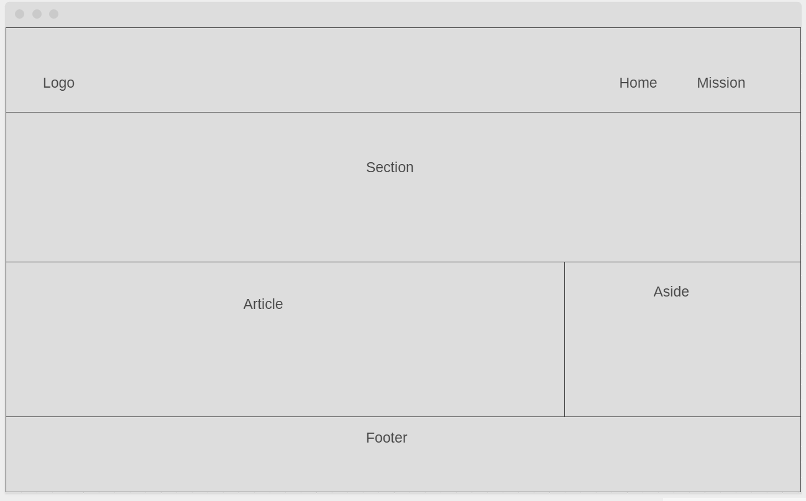

# Development Strategy

> `Save the Earth`

This exercise is about practice development strategies, Git & GitHub and HTML/CSS

## Wireframe

<!-- include a wireframe for your project in this repository, and display it here -->
<!-- wireframe.cc is a good site for getting started with wireframes -->

[wireframe](https://wireframe.cc/QTuicO)

## 0. Set-Up

**A User can see my initial repository and live demo**

### Repo

- Generate from Template
- Write initial, basic README
- Turn on GitHub Pages

## 1. User Story: HTML Structure

**As a visitor I want to see the html structure of the page**

### Repo

This user story was developed on a branch called `html-structure`

### HTML

Making the structure of the page

### CSS

There is no styling in this step

## 2. User Story: Styling page

**As a visitor I want to see the style of the page**

### Repo

This user story was developed on a branch called `styling`

### HTML

There is no big changes in HTML structure in this step

### CSS

Styling of the page

## Finishing Touches

This user story was developed on a branch called `finishing-touches`

- Write final, complete README:
  - [makeareadme.com](https://www.makeareadme.com/)
  - [bulldogjob](https://bulldogjob.com/news/449-how-to-write-a-good-readme-for-your-github-project)
  - [meakaakka](https://medium.com/@meakaakka/a-beginners-guide-to-writing-a-kickass-readme-7ac01da88ab3)
- Validate code to check for any last mistakes
